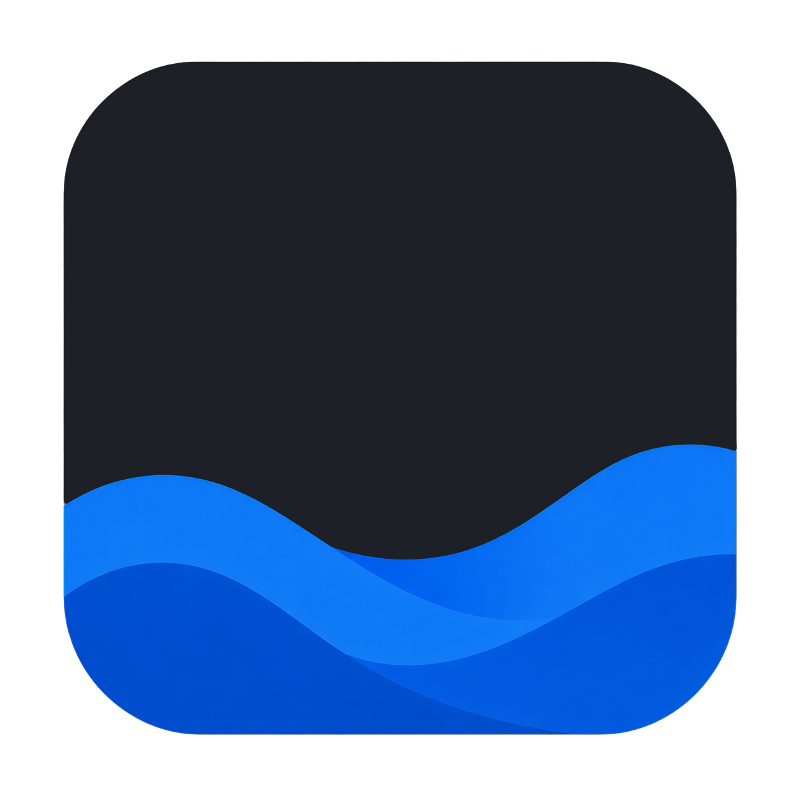
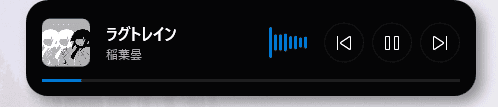
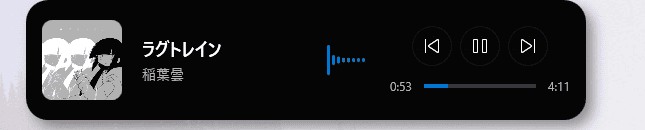

# NoraBar

[English README](README.md)

画面のいちばん上に、ふっと現れる小さな音楽HUD。

NoraBar は Windows デスクトップ向けの WPF アプリケーションです。普段は画面上端に 2px の細いエリアとして静かに待機し、マウスを近づけるとミュージックコントローラーとして開きます。再生中の曲名、アーティスト、アルバムアート、再生位置、波形ビジュアライザーを、作業の邪魔にならない場所へまとめます。

## できること

- **画面上端に常駐する HUD**
  - 通常時は目立たず、ホバー時だけ展開します。
  - 最前面表示で、必要な瞬間にすぐ触れます。

- **音楽アプリとの連携**
  - Windows のメディアセッションから曲名、アーティスト、アルバムアート、再生状態、再生位置を取得します。
  - 再生、一時停止、前の曲、次の曲を HUD から操作できます。

- **音に反応する波形ビジュアライザー**
  - CSCore の WASAPI ループバックを使い、PC で鳴っている音を 8 本のバーで表示します。
  - 静かな机の上に、少しだけライブ感が増えます。

- **同期歌詞の表示**
  - LRCLIBと連携し、再生中の曲に合わせて同期歌詞を取得・表示します。

- **2つのデザインスタイル**
  - `Minimal Floating Pill`: 小さく軽い、日常使い向けのスタイル。
  - `Productivity Command Island`: アルバムアートと進捗表示を広めに見せるスタイル。

- **設定画面**
  - デザインスタイル、プログレスバー表示、自動起動、表示言語を切り替えられます。
  - 編集モードでHUDをドラッグし、お好みの位置に配置できます。
  - GitHub Releases の更新確認と、サードパーティライセンス表示も備えています。

## スクリーンショット

| Minimal Floating Pill | Productivity Command Island |
| --- | --- |
|  |  |

## 必要な環境

- Windows 10 以降
- [.NET Desktop Runtime 10](https://dotnet.microsoft.com/download/dotnet/10.0)

NoraBar は `net10.0-windows` を対象にしているため、実行には .NET 10 Desktop Runtime が必要です。利用している Windows のアーキテクチャに合う最新の .NET Desktop Runtime 10.x をインストールしてください。SDK、Visual Studio、.NET CLI はソースコードからビルドする場合にのみ必要です。

## 起動方法

GitHub Releases からポータブル版またはインストーラー版をダウンロードして起動します。

- ポータブル版: zip ファイルを任意のフォルダーへ展開し、NoraBar 実行ファイルを起動します。
- インストーラー版: インストーラーを実行し、インストール後に NoraBar を起動します。

通常起動では設定画面も開きます。Windows スタートアップから起動された場合は `--startup` 引数が付き、HUD だけが静かに常駐します。

ソースコードからビルドして起動する手順は [開発ガイド](docs/wiki/開発ガイド.md) を参照してください。

## 使い方

1. NoraBar を起動します。
2. 画面上端の中央付近へマウスを移動します。
3. HUD が開いたら、曲情報や操作ボタンを確認します。
4. 右クリックメニューまたはシステムトレイから設定を開きます。

設定は `%AppData%\NoraBar\settings.json` に保存されます。

## Wiki

詳しい使い方や設計メモは Wiki にまとめています。

- [Wiki Home](docs/wiki/ホーム.md)
- [はじめ方](docs/wiki/はじめ方.md)
- [設定ガイド](docs/wiki/設定ガイド.md)
- [開発ガイド](docs/wiki/開発ガイド.md)
- [アーキテクチャ](docs/wiki/アーキテクチャ.md)
- [トラブルシューティング](docs/wiki/トラブルシューティング.md)

英語版 Wiki は以下から確認できます。

- [Wiki Home](docs/wiki/Home.md)
- [Getting Started](docs/wiki/Guide-Getting-Started.md)
- [Configuration Guide](docs/wiki/Guide-Configuration.md)
- [Development Guide](docs/wiki/Development.md)
- [Architecture](docs/wiki/Architecture.md)
- [Troubleshooting](docs/wiki/Troubleshooting.md)

`docs/wiki/` 配下の Markdown は、`main` ブランチへの push 時に GitHub Wiki へ同期されます。

## 技術スタック

- C# / WPF
- .NET
- XAML
- Windows Media Control API
- CSCore
- Windows Forms NotifyIcon

## ライセンス

サードパーティライブラリとして CSCore を使用しています。ライセンス情報はアプリ内の設定画面から確認できます。

NoraBar は GNU Affero General Public License v3.0 の下で公開されています。詳細は [LICENSE](LICENSE) を参照してください。

## 名前について

NoraBar は、画面の上端にある小さな切り欠きのような場所から、必要な情報だけを軽く差し出すアプリです。

主役はアプリではなく、作業中のあなたです。NoraBar はその上に乗る、控えめで、少し気の利いた HUD を目指しています。
